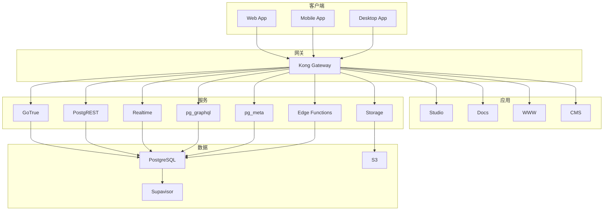

# Supabase 架构图

## 整体架构

## 技术栈

### 前端
- React 18 + Next.js 15
- TypeScript
- Tailwind CSS
- Radix UI
- TanStack Query

### 后端
- PostgreSQL 15
- PostgREST (REST API)
- pg_graphql (GraphQL)
- GoTrue (认证)
- Realtime (WebSocket)
- Edge Functions (Deno)

### 工具
- pnpm + Turbo
- ESLint + Prettier
- Vitest
- Docker + Vercel
