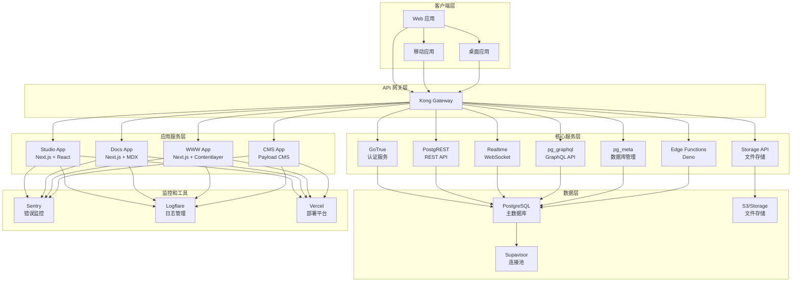
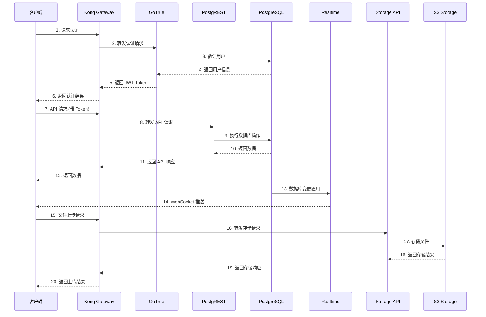
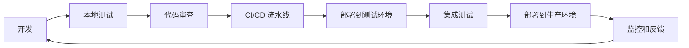

# Supabase 项目技术栈详细分析

## 项目概述

Supabase 是一个开源的 Firebase 替代方案，基于 PostgreSQL 构建的现代开发平台。该项目采用 Monorepo 架构，使用 pnpm workspace 和 Turbo 进行管理。

## 技术栈分析

### 1. 项目架构

#### 1.1 Monorepo 结构
- **包管理器**: pnpm (v9.15.5)
- **构建工具**: Turbo (v2.3.3)
- **Node.js 版本**: >=22
- **TypeScript**: ~5.5.0

#### 1.2 应用层 (apps/)
```
apps/
├── studio/          # Supabase Studio - 管理界面
├── docs/            # 文档网站
├── www/             # 主网站
├── ui-library/      # UI 组件库展示
├── design-system/   # 设计系统
└── cms/             # 内容管理系统
```

#### 1.3 包层 (packages/)
```
packages/
├── ui/              # 核心 UI 组件库
├── ui-patterns/     # UI 模式组件
├── icons/           # 图标库
├── config/          # 共享配置
├── common/          # 通用工具
├── api-types/       # API 类型定义
├── shared-data/     # 共享数据
├── ai-commands/     # AI 命令
├── pg-meta/         # PostgreSQL 元数据
├── generator/       # 代码生成器
├── eslint-config-supabase/  # ESLint 配置
├── tsconfig/        # TypeScript 配置
└── build-icons/     # 图标构建工具
```

### 2. 前端技术栈

#### 2.1 核心框架
- **React**: 18.x (catalog:)
- **Next.js**: 15.3.1 (catalog:)
- **TypeScript**: ~5.5.0

#### 2.2 UI 框架
- **Tailwind CSS**: ^3.4.1
- **Radix UI**: 各种组件 (Dialog, Accordion, Select 等)
- **Headless UI**: ^1.7.17
- **Framer Motion**: ^11.11.17 (动画)
- **Lucide React**: ^0.436.0 (图标)

#### 2.3 状态管理
- **TanStack Query**: 4.35.7 (数据获取和缓存)
- **React Hook Form**: ^7.45.0 (表单管理)

#### 2.4 开发工具
- **ESLint**: ^8.57.0
- **Prettier**: 3.2.4
- **Vitest**: ^3.0.5 (测试)
- **Turbo**: 2.3.3 (构建系统)

### 3. 后端技术栈

#### 3.1 数据库
- **PostgreSQL**: 15.x (核心数据库)
- **pg_graphql**: GraphQL API 扩展
- **postgres-meta**: 数据库管理 API

#### 3.2 API 服务
- **PostgREST**: RESTful API 服务器
- **GoTrue**: JWT 认证服务
- **Realtime**: Elixir WebSocket 服务
- **Storage API**: 文件存储服务
- **Edge Functions**: Deno 运行时

#### 3.3 网关和代理
- **Kong**: API 网关
- **Supavisor**: PostgreSQL 连接池

### 4. 开发工具链

#### 4.1 构建和部署
- **Vercel**: 部署平台
- **Docker**: 容器化
- **GitHub Actions**: CI/CD

#### 4.2 代码质量
- **Knip**: 未使用代码检测
- **Vale**: 文档 linting
- **Supa-mdx-lint**: MDX 文件检查

#### 4.3 测试
- **Vitest**: 单元测试
- **Playwright**: E2E 测试
- **Coverage**: 代码覆盖率

### 5. 第三方服务集成

#### 5.1 认证和支付
- **Stripe**: 支付处理
- **GitHub OAuth**: 社交登录
- **hCaptcha**: 验证码

#### 5.2 监控和分析
- **Sentry**: 错误监控
- **Google Tag Manager**: 分析
- **Logflare**: 日志管理

#### 5.3 AI 和搜索
- **OpenAI**: AI 功能
- **AWS Bedrock**: AI 模型
- **Vector Search**: 向量搜索

## 详细架构图



## 数据流架构



## 开发工作流



## 关键技术特点

### 1. 模块化设计
- 每个服务都是独立的，可以单独部署和扩展
- 使用 workspace 管理多个包和应用
- 支持微服务架构

### 2. 类型安全
- 全栈 TypeScript 支持
- 自动生成的 API 类型
- 严格的类型检查

### 3. 实时能力
- WebSocket 支持实时数据同步
- 基于 PostgreSQL 的逻辑复制
- 低延迟的数据推送

### 4. 可扩展性
- 基于 PostgreSQL 的强大查询能力
- 支持自定义函数和扩展
- 水平扩展能力

### 5. 开发者体验
- 自动生成的 API 文档
- 内置的开发工具
- 丰富的客户端 SDK

## 总结

Supabase 项目采用了现代化的技术栈，具有以下优势：

1. **开源优先**: 所有核心组件都是开源的
2. **PostgreSQL 原生**: 充分利用 PostgreSQL 的强大功能
3. **开发者友好**: 提供类似 Firebase 的开发者体验
4. **可扩展**: 支持从简单应用到复杂企业级应用
5. **实时能力**: 内置实时数据同步功能
6. **类型安全**: 全栈 TypeScript 支持

这个架构设计使得 Supabase 能够为开发者提供一个强大、灵活且易于使用的后端即服务 (BaaS) 平台。
