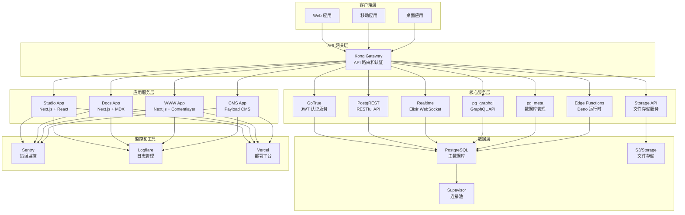
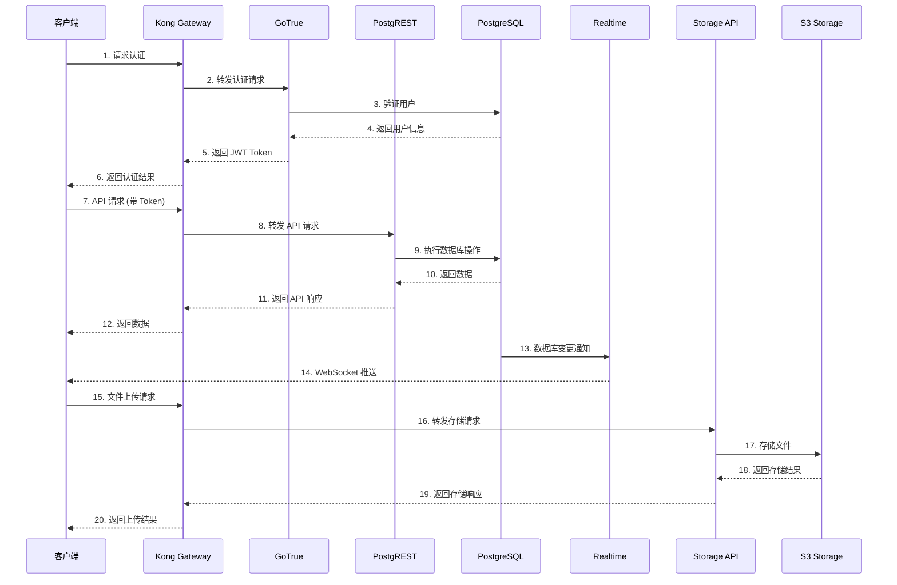
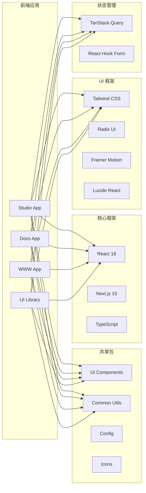
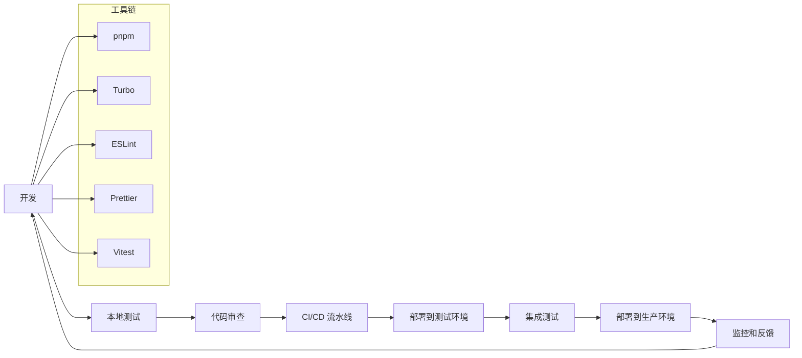
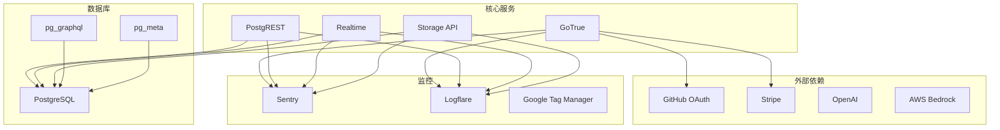

# Supabase 架构图

## 整体架构图

## 数据流架构

## 前端技术栈架构

## 开发工作流

## 服务依赖关系

## 技术栈总结

### 前端技术
- **框架**: React 18 + Next.js 15
- **语言**: TypeScript
- **样式**: Tailwind CSS
- **组件**: Radix UI + Headless UI
- **动画**: Framer Motion
- **状态**: TanStack Query + React Hook Form

### 后端技术
- **数据库**: PostgreSQL 15
- **API**: PostgREST (REST) + pg_graphql (GraphQL)
- **认证**: GoTrue (JWT)
- **实时**: Realtime (Elixir WebSocket)
- **存储**: Storage API + S3
- **函数**: Edge Functions (Deno)

### 基础设施
- **网关**: Kong
- **连接池**: Supavisor
- **部署**: Vercel + Docker
- **监控**: Sentry + Logflare
- **CI/CD**: GitHub Actions

### 开发工具
- **包管理**: pnpm
- **构建**: Turbo
- **测试**: Vitest
- **代码质量**: ESLint + Prettier + Knip
